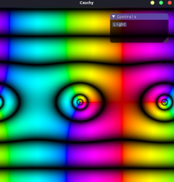

# Cauchy
`Cauchy` is a simple, but hardware accelerated, complex function plotter.
It plots pretty examples of complex functions

## Examples
`Cauchy` produces relatively standard domain colorings for complex functions.

Phase is always represented by hue, with red being
an angle of 0, and light blue being an angle of pi.

For the magnitude of the number, there are 2 plotting modes:

We have light-valued domain coloring, like
in this plot of `sin(z)`:

In this mode, the larger the magnitude gets, the more white the plot is.

There's also a mode for doing dark concentric plots:


In this mode, each line represents an exponential increase in magnitude.

## Running
Running should be as simple as:
```
cargo run
```
Debug mode should be performant enough.
